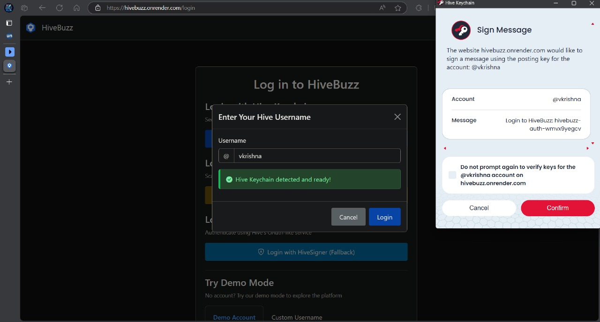

# HiveBuzz

A modern interface for interacting with the Hive blockchain.

## Service Previews

HiveBuzz supports automatic service previews for pull requests using Render. This allows you to preview changes before merging them into the main branch.

### How to Use Service Previews

#### Automatic Previews

By default, all pull requests will generate a service preview. The preview URL will be posted as a comment on your pull request once the deployment is complete.

To skip generating a preview, include one of the following strings in your pull request title:
- `[skip preview]`
- `[skip render]`
- `[preview skip]`
- `[render skip]`

#### Manual Previews

If manual previews are configured, you need to explicitly request a preview by including `[render preview]` in your pull request title.

#### Using the Preview

Each pull request gets its own isolated preview environment with a unique URL. Preview URLs follow this format:
```
https://pr-{PR_NUMBER}.hivebuzz.onrender.com
```

Preview environments have the following characteristics:
- They use the same configuration as the main deployment (environment variables, etc.)
- They are automatically updated when you push new commits to the PR
- They are automatically deleted when the PR is merged or closed

### For Developers

Preview environments set the `IS_PULL_REQUEST` environment variable to `true`, which your code can detect to modify behavior specifically for previews.

Example:
```python
import os

# Check if running in a preview environment
is_preview = os.environ.get('IS_PULL_REQUEST') == 'true'

if is_preview:
    # Use test database or mock services
    DATABASE_URL = os.environ.get('TEST_DATABASE_URL')
else:
    # Use production database
    DATABASE_URL = os.environ.get('DATABASE_URL')
```

## Additional Documentation

For more information about HiveBuzz, please see the following resources:
- [Installation Guide](./docs/installation.md)
- [API Documentation](./docs/api.md)
- [Contributing Guidelines](./CONTRIBUTING.md)

## Overview

HiveBuzz is a decentralized social media application built on the Hive blockchain. It provides multiple secure authentication methods (Hive Keychain, HiveSigner, and HiveAuth), allows users to browse blockchain content, create posts, and manage Hive wallet functions—all through an intuitive interface with customizable themes.

## Features

- **Multi-method Authentication**:
	- ✅ Hive Keychain browser extension integration
	- ✅ HiveSigner OAuth-like authentication flow
	- ✅ HiveAuth mobile QR code authentication

- **Blockchain Data Reading**:
	- ✅ View trending, hot, and new posts from the Hive blockchain
	- ✅ Browse user profiles with reputation and account details
	- ✅ Examine wallet balances and transaction history

- **Transaction Broadcasting**:
	- ✅ Create and publish posts directly to the Hive blockchain
	- ✅ Vote on content using Hive Keychain
	- ✅ Power up/down HIVE and transfer funds between accounts

- **Additional Features**:
	- Responsive design with light/dark theme toggle
	- User preferences stored locally
	- Content caching for improved performance
	- Post and comment rendering with markdown support

## Website for HiveBuzz
- **FullFills the Three Main Criteria's:**

1. *Login* using Hive Keychain, Hive Signer, or Hive Auth.



2. *Broadcasting transactions* on the Hive chain.


3. *Reading transactions* from the Hive chain.


## Hive APIs Used

HiveBuzz leverages multiple Hive blockchain APIs for additional functionality:

1. **`condenser_api.get_accounts`**: Fetches user profile data
2. **`condenser_api.get_content`**: Retrieves post and comment content
3. **`condenser_api.get_discussions_by_trending`**: Gets trending posts
4. **`condenser_api.get_discussions_by_created`**: Gets newest posts
5. **`condenser_api.get_discussions_by_hot`**: Gets hot posts
6. **`database_api.find_accounts`**: Searches for user accounts
7. **`account_history_api.get_account_history`**: Retrieves user activity history
8. **`rc_api.find_rc_accounts`**: Gets resource credit information
9. **`bridge.get_ranked_posts`**: Fetches ranked posts (via Hivemind)
10. **`bridge.get_discussion`**: Gets full discussion threads

## Technology Stack

- **Backend**: Python with Flask framework
- **Frontend**: HTML, CSS, JavaScript
- **Storage**: SQLite for caching and user preferences
- **Blockchain Integration**: Hive Keychain, HiveSigner API, HiveAuth
- **APIs**: Hive blockchain API, dbuzz API integration

## Project Structure

```
HiveBuzz/
├── app.py                 # Main Flask application
├── config.py              # Configuration settings
├── database.py            # Database operations
├── session_manager.py     # User session management
├── requirements.txt       # Python dependencies
├── static/                # Static assets
│   ├── css/               # Stylesheets
│   ├── js/                # JavaScript files
│   │   ├── hive-keychain.js  # Keychain integration
│   │   ├── hiveauth.js    # HiveAuth integration
│   │   ├── hivesigner.js  # HiveSigner integration
│   │   └── posts.js       # Post management
│   └── img/               # Image assets
├── templates/             # HTML templates
│   ├── base.html          # Base template
│   ├── login.html         # Authentication page
│   ├── posts.html         # Post listing page
│   ├── wallet.html        # Wallet management
│   └── profile.html       # User profile page
└── utils/                 # Utility modules
		├── hive_api.py        # Hive blockchain API client
		├── hivesigner.py      # HiveSigner utilities
		├── hiveauth.py        # HiveAuth integration
		├── markdown_utils.py  # Content formatting
		└── posts_cache.py     # Post caching system
```

## Authentication Methods

### 1. Hive Keychain

Users can securely authenticate using the Hive Keychain browser extension, which signs a challenge without exposing private keys:

```javascript
window.hive_keychain.requestSignBuffer(
		username,
		`Login to HiveBuzz: ${challenge}`,
		"Posting",
		(response) => {
				if (response.success) {
						// Authentication successful
				}
		}
);
```

### 2. HiveSigner

OAuth-like authentication flow where users are redirected to HiveSigner to approve the application:

```javascript
// HiveSigner authentication redirect
const authUrl = HiveSigner.getAuthUrl(username, state);
window.location.href = authUrl;
```

### 3. HiveAuth

Mobile-friendly authentication via QR code scanning:

```javascript
// Generate HiveAuth QR code
const authData = await hiveAuthInstance.getAuthData();
QRCode.toCanvas(document.getElementById('hiveauth-qrcode'), authData.login_url);
```

## Reading Data from Hive

HiveBuzz reads data from the Hive blockchain through several methods:

```python
# Get user profile data
hive_api_client = get_hive_api()
user_data = hive_api_client.get_account(username)

# Fetch trending posts
trending_posts = posts_cache.get_posts(
		feed_type="trending",
		tag=tag_filter,
		limit=20
)

# Get account history/transactions
history = hive_api_client.get_account_history(username, limit=20)

# Get wallet balances
wallet_data = hive_api_client.get_wallet_data(username)
```

## Broadcasting Transactions

Users can broadcast various transactions to the Hive blockchain:

```javascript
// Vote on content
HiveKeychainHelper.requestVote(username, author, permlink, weight)
		.then(response => {
				if (response.success) {
						// Vote successful
				}
		});

// Create a post
const operations = [
		["comment", {
				parent_author: "",
				parent_permlink: mainTag,
				author: username,
				permlink: permlink,
				title: title,
				body: body,
				json_metadata: JSON.stringify({ tags: tags })
		}]
];

window.hive_keychain.requestBroadcast(
		username,
		operations,
		"posting",
		response => {
				// Handle response
		}
);
```

## Setup Instructions

### Prerequisites
- Python 3.9 or higher
- pip (Python package manager)
- A modern web browser with Hive Keychain extension installed (optional)

### Installation Steps
1. Clone the repository:
	 ```bash
	 git clone https://github.com/Life-Experimentalist/HiveBuzz
	 cd HiveBuzz
	 ```

2. Create and activate a virtual environment:
	 ```bash
	 python -m venv venv
	 source venv/bin/activate  # On Windows: venv\Scripts\activate
	 ```

3. Install dependencies:
	 ```bash
	 pip install -r requirements.txt
	 ```

4. Create a .env file in the root directory:
	 ```
	 SECRET_KEY=your-secret-key
	 HIVESIGNER_APP_NAME=your-hivesigner-app-name
	 HIVESIGNER_CLIENT_SECRET=your-hivesigner-client-secret
	 APP_URL=http://localhost:5000
	 ENVIRONMENT=development
	 ```

5. Initialize the database:
	 ```bash
	 python -c "import database; database.init_db()"
	 ```

6. Run the application:
	 ```bash
	 flask run
	 ```
	 The application will be available at http://localhost:5000/

## Database Management

HiveBuzz uses SQLite for database storage:

```bash
# Initialize the database
python -c "import database; database.init_db()"

# Create a database management tool
python db_manager.py init

# Show database statistics
python db_manager.py stats

# Clear expired sessions
python db_manager.py clear-sessions
```

## License

This project is licensed under the MIT License - see the LICENSE file for details.

## Acknowledgements

- Hive blockchain developers and community
- dbuzz platform team
- All contributors to this project

---
